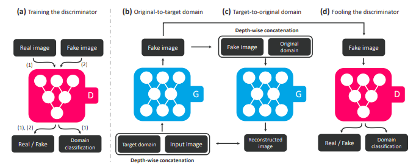
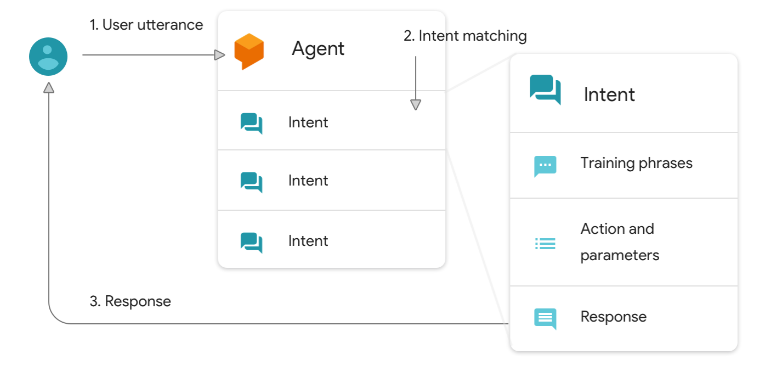
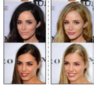
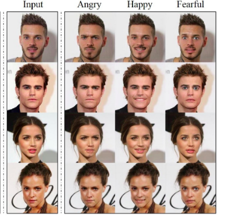
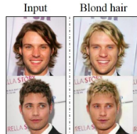
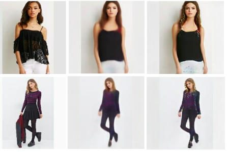
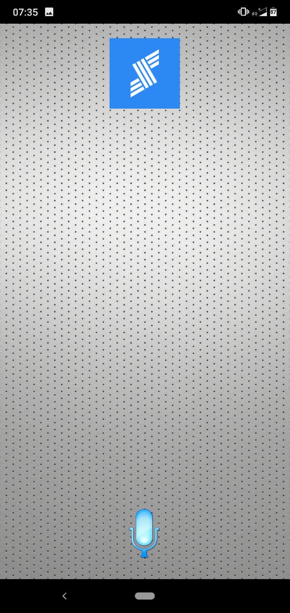
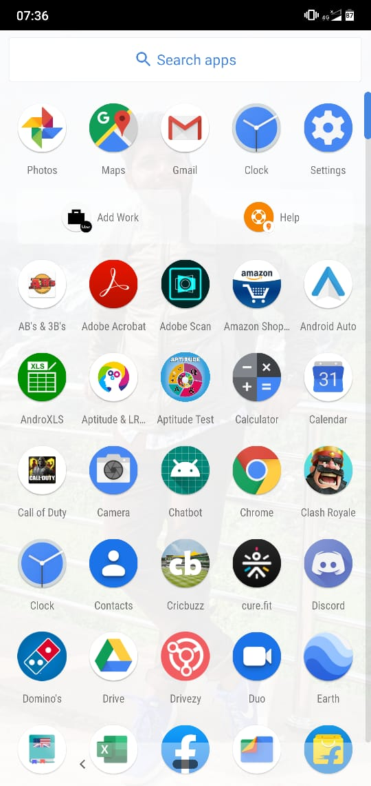
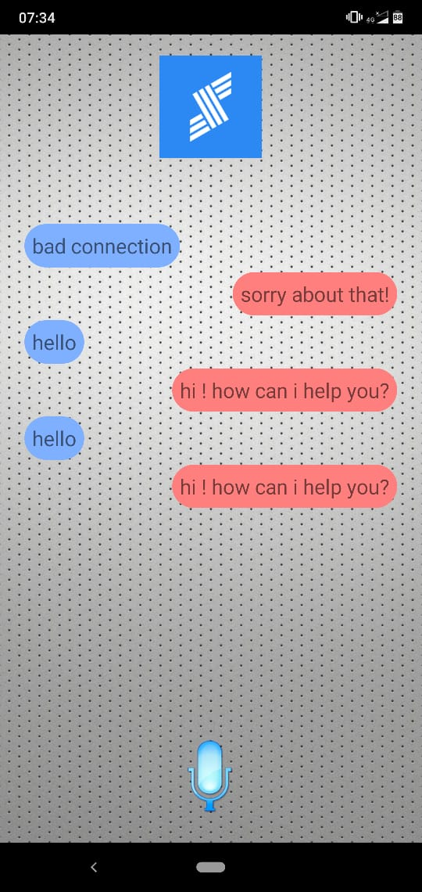

# StayConnected---Devengers
HackNight 5.0 

## Problem Statement:

Old Age homes are very difficult place to live in. Lots of people don’t have a family that can support them and lots of residents are crushed by mobility problems. These People have sacrificed a lot in thier whole lifetime to support thier families. Now when they need support from their family, they have to face this harsh reality. We Devengers wanted to do something for them. 

**StayConnected** is a Virtual Chatbot. It trains over few images of the loved ones and creats a virtual Avatar which resembles them. No one can replace family, But being able to talk to someone who looks like them and talks like them will definately ease some pain. 

## Technology Stack:

* Tensorflow
* Jupyter Notebook
* StarGANs
* Azure Databricks
* Android Studio
* Dialog Flow
* Flask
* Textblob
* Python
* Azure ML Services

## Blockers:

* To create a generic application, the model has to be trained over a huge amount of data. 
* GANs are used to create Avatar, training them is extremely difficult as they are prone to Nash Equilibrium and Mode Collapse.
* Training GANs in 12 Hours is really diffiult. 
* No expertise in the team to deploy models on Azure. 

## Approach

*Challenge 1 Create a Virtual Realisitic Avatar*:

To create Realistic Virtual Avatars we have used StarGANs

### Architecture of StarGAN:

StarGAN has the generator network composed of two convolutional layers with the stride size of two for downsampling, six residual blocks, and two transposed convolutional layers with the stride size of two for upsampling.

We leverage PatchGANs for the discriminator network, which classifies whether local image patches are real or fake. 

### Loss and Training 

* Domain Classification Loss. 
* Reconstruction Loss.
* 200000 Epochs

[Research paper](https://arxiv.org/pdf/1711.09020.pdf)

*Challenge 2 Make it Talk*:

We first create an Agent within Dialogflow. An agent is essentially the entire chatbot application, the experience of collecting what the user is saying, mapping it to an intent, taking an action on it and providing the user with a response. And in the Agent, this all starts with a trigger event, called an Utterance. Once the bot is activated and has collected the user utterance. We need to understand the users intent. Essentially, why do they want to talk to our bot..

[Further Reading](https://medium.com/google-cloud/deconstructing-chatbots-getting-started-with-dialogflow-4f91deb32135)

*Challenge3 Run on Android*:

The final Challenge is to integrate all these things and make it avaiable as a  package to the user. 

### How Azure can help us:

* To train GANs 
* Plotform to Deploy Machine Learning Models. 

### Results:

Results are as follows:

#### GANs to create a Virtual Realistic Avatar:

The left side is the input and the right side is the output, the generated Images are very much real images.

#### GANs to Generate Emotions:

We even add emotion to the images to make it look alive.

#### GANs to Generate Hairs:

We can customize the avatar by addiing variations to hairs. 

#### GANs to Generate Different Clothing:

We even can change dress everyday so to make it more realistic.

#### Android Implementation:

This is the android Implementation for chatbot

#### Chatbot Implementation:

This is the output generated by chatbot

